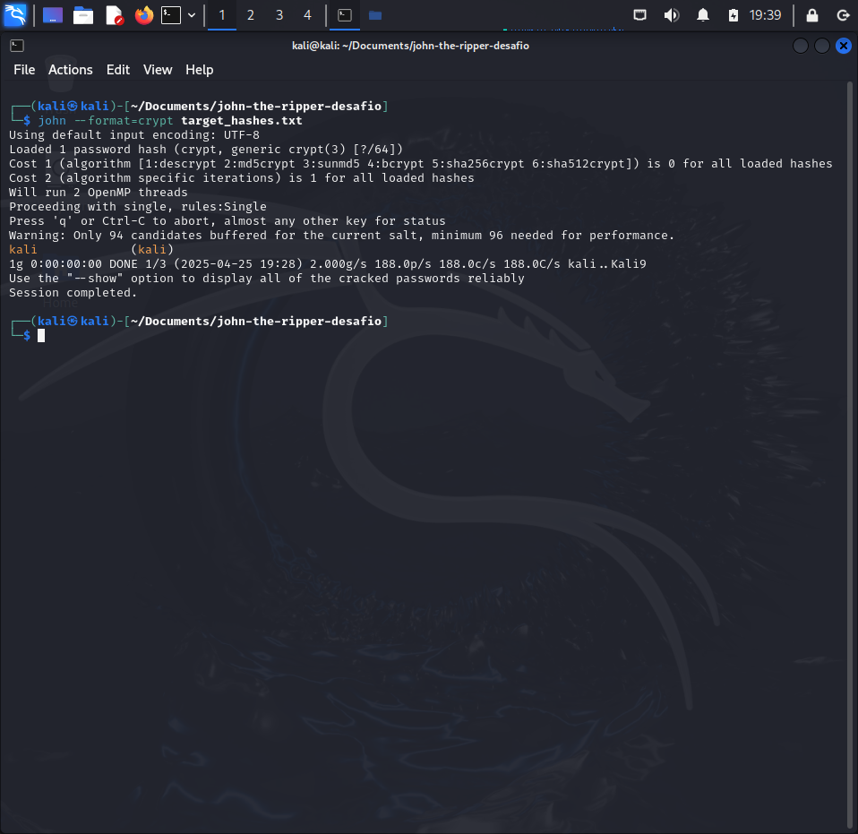
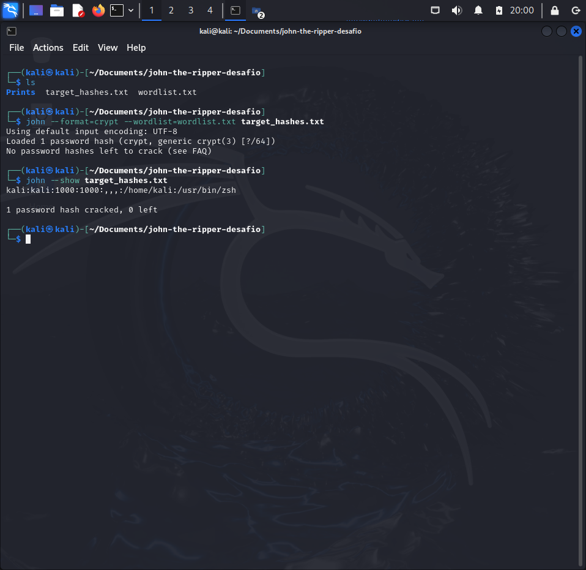

# 🔐 CTF John Lab – Quebra de Hash Yescrypt no Kali Linux

Este repositório documenta a resolução de um desafio CTF realizado em ambiente real no 
**Kali Linux**, com foco em **análise forense e quebra de hash** utilizando o 
**John the Ripper**. O objetivo foi simular uma situação prática de pós-exploração, 
acessando arquivos reais do sistema e aplicando técnicas de cracking.

---

## 🧪 Sobre o desafio

O desafio consistia em obter acesso aos arquivos sensíveis do sistema Linux 
(`/etc/passwd` e `/etc/shadow`), combiná-los e utilizar o John the Ripper para identificar 
uma senha hash yescrypt com o prefixo `$y$`.

---

## 🛠 Ferramentas e técnicas utilizadas

- 💻 Kali Linux (ambiente real de laboratório)
- 🔨 John the Ripper (Jumbo version)
- 🗂 Arquivos reais do sistema Linux: `/etc/passwd` e `/etc/shadow`
- 🧩 Comando `unshadow` para gerar o arquivo final de hashes
- 📁 Arquivo final: `target_hashes.txt`
- 📸 Prints da execução disponíveis na pasta `prints`

---

## ⚙️ Etapas do processo

1. **Acessando e unindo os arquivos com `unshadow`:**
   Usamos o comando `unshadow` para combinar os arquivos 
   `passwd.txt` e `shadow.txt` em um único arquivo `target_hashes.txt`:

   ```bash
   sudo unshadow /etc/passwd /etc/shadow > /kali/Documents/john-the-ripper-ctf-lab/ target_hashes.txt
   ```

3. **Executando o John the Ripper (sem wordlist):**
   Para realizar o cracking da senha sem usar uma wordlist, você pode rodar o John 
   diretamente:

   ```bash
   john --format=yescrypt target_hashes.txt
   ```

4. **(Opcional) Execução com wordlist personalizada:**
   Caso você tenha uma wordlist personalizada na pasta, pode utilizá-la assim:

   ```bash
   john --format=yescrypt --wordlist=wordlist.txt target_hashes.txt
   ```

5. **Visualizando a senha descoberta:**
   Após o John terminar o processo de cracking, você pode visualizar a senha com:

   ```bash
   john --show target_hashes.txt
   ```

---

## 📸 Prints da execução

### Execução do comando `unshadow`


### John the Ripper quebrando a senha



### Senha descoberta com sucesso



---

## 📁 Estrutura dos arquivos

```
📂 john-the-ripper-desafio
├── target_hashes.txt         # Arquivo gerado com unshadow (passwd + shadow)
├── prints/                   # Capturas de tela do processo
│   ├── unshadow.png
│   ├── john-executando.png
│   └── show-executado.png
└── README.md                 # Este documento
```

---

## 🧠 Aprendizados

- Como extrair arquivos de senha reais do Linux e analisá-los com ferramentas forenses
- Diferença entre ataques com wordlist e sem wordlist (modo incremental)
- Identificação do tipo de hash (yescrypt) a partir do prefixo `$y$`
- Interpretação de mensagens comuns do John como:
  - `No password hashes loaded`
  - `No password hashes left to crack`

---

## 🔗 Conecte-se

Me acompanhe no [LinkedIn](https://www.linkedin.com/in/alexanderpastana/)!

---

> *Este projeto foi desenvolvido como parte dos meus estudos práticos em segurança cibernética, com foco em técnicas ofensivas e análise forense.*
